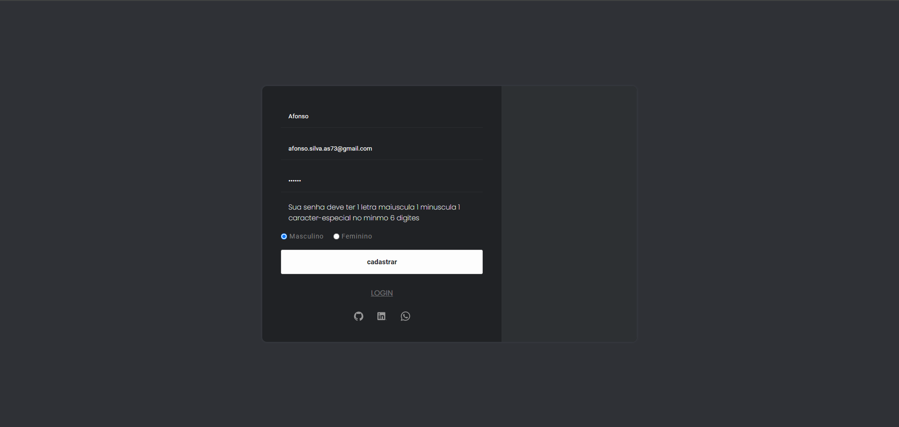
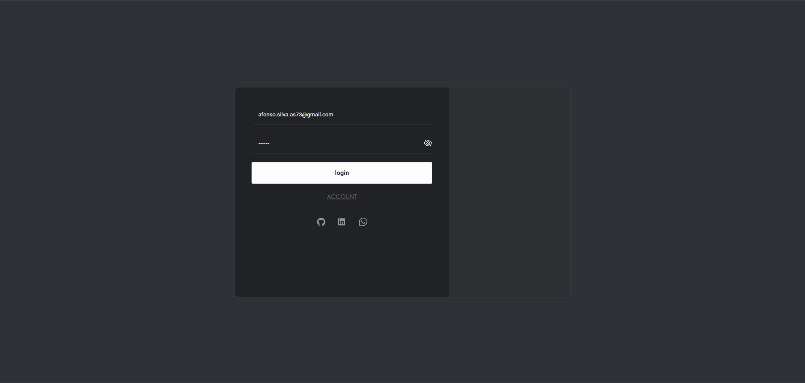
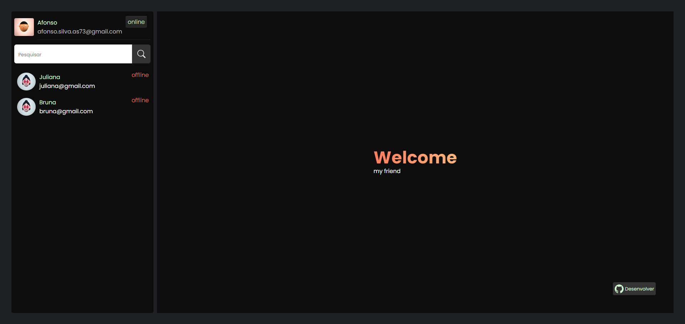
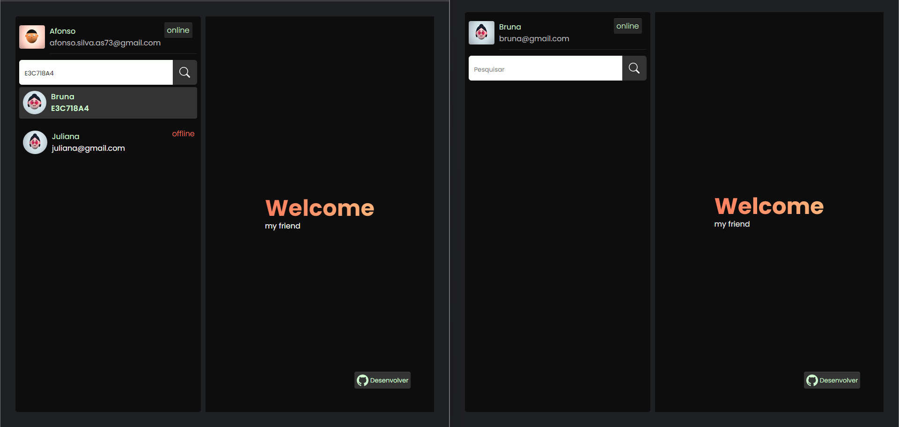
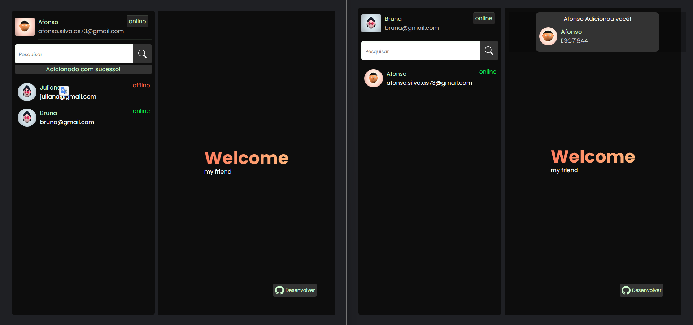
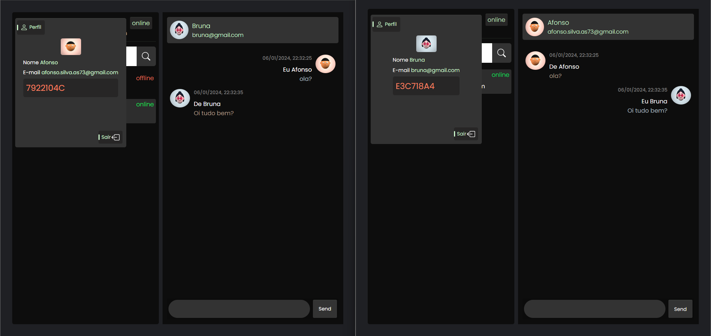
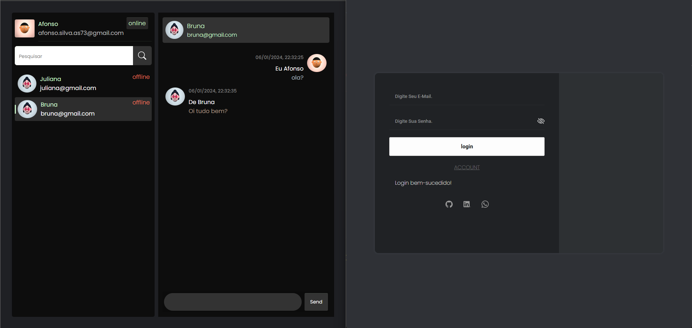

## [Chat Web](https://login-users-systen.netlify.app/)

Bem-vindo ao repositório dedicado a um inovador chat de mensagens! Ao clicar no título, você será direcionado para a tela de login. Embora algumas melhorias ainda estejam em desenvolvimento, este projeto é uma abordagem simples e divertida para interações em tempo real.

## Visão Geral

Este é um projeto de chat em TEMPO REAL desenvolvido em [React + Vite], utilizando linguagens como [HTML, CSS, JavaScript, JSX, JWT, MySQL], e aproveitando o poder do framework [Socket.IO]. O projeto também faz uso de duas APIs para o socket e as telas de login e cadastro, conectando-se a um banco de dados MySQL hospedado na nuvem pela PlanetScale. Toda a implementação está a cargo de um desenvolvedor, e todas as ferramentas empregadas são gratuitas, desde o ambiente de desenvolvimento até a hospedagem.

## Funcionalidades Principais

- Interações dinâmicas entre usuários,
- Recurso de pesquisa e adição de novos usuários,
- Envio e recebimento de mensagens em tempo real,
- Telas de login e cadastro intuitivas.

## Capturas de Tela

## Pré-requisitos

- [Conhecimento em ReactJS, JavaScript, HTML, CSS, Express, Socket.IO, API, MySQL, UUID, BcryptJS (atenção, pode ocorrer conflito com o servidor da Vercel se 'bcrypt' for usado, sendo aconselhável 'bcryptjs'), Dotenv, Cors, Body-parser, Crypto para gerar uma chave SECRET, Moment].
Estudo contínuo em ReactJS.

## Contribuição

Você é encorajado a contribuir com este projeto. Se deseja adicionar recursos, resolver problemas ou aprimorar a documentação, siga estas etapas:

1. Faça um fork deste repositório.
2. Crie um branch para a sua contribuição: `git checkout -b minha-contribuicao`.
3. Implemente as alterações desejadas e faça o commit: `git commit -m 'Adicionei uma nova funcionalidade'`.
4. Faça o push para o branch: `git push origin minha-contribuicao`.
5. Abra um pull request para revisão.

## Contato

- **Nome:** Afonso
- **E-mail:** afonso.silva.as73@gmail.com
- **LinkedIn:** [Afonso no LinkedIn](https://www.linkedin.com/in/afonso-silva-09b63b272/)
- **WhatsApp:** 47 9 8889-5197
